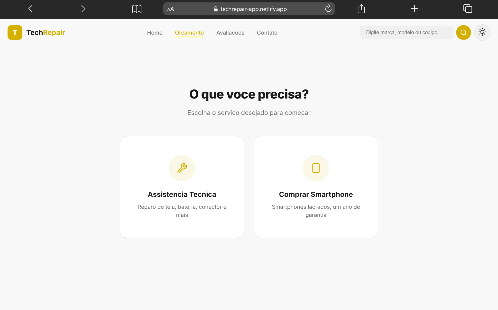
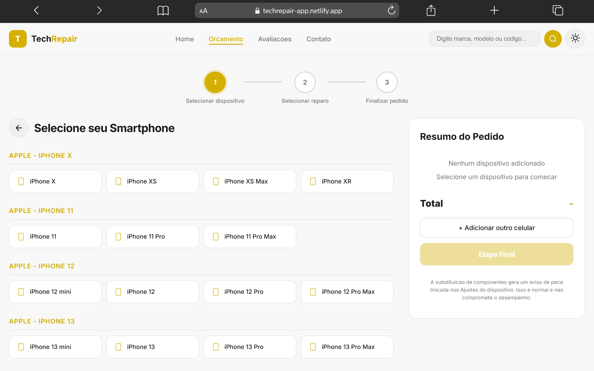
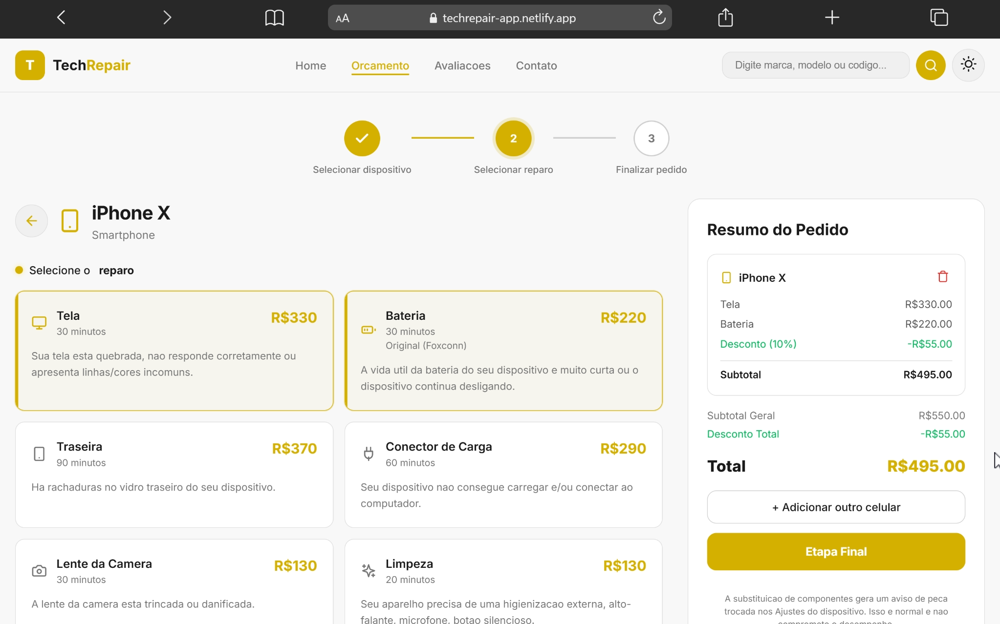
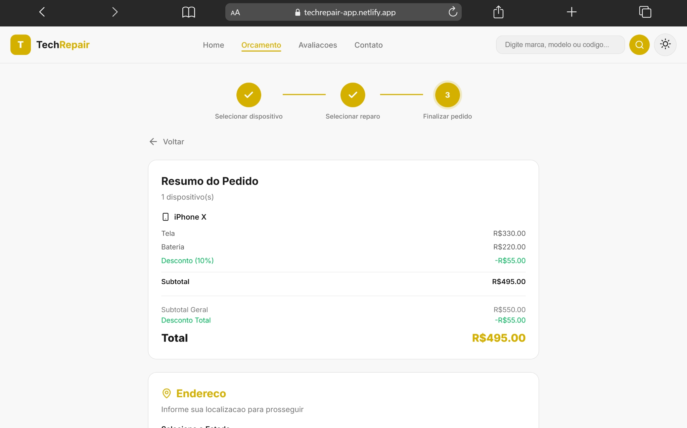
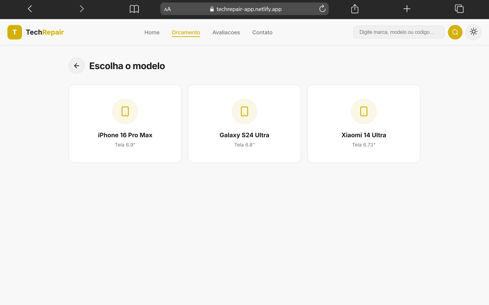
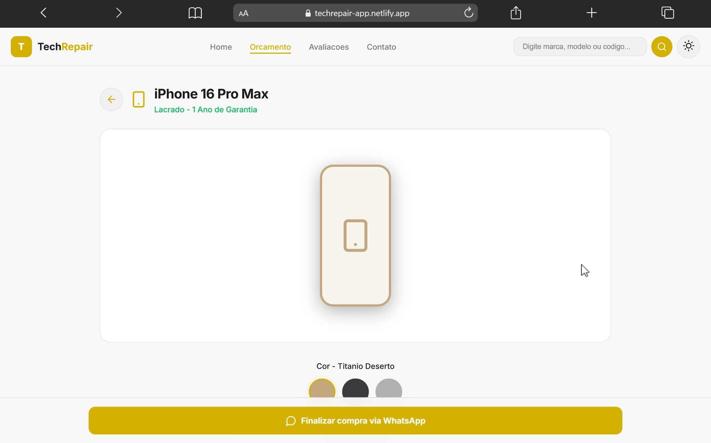

# TechRepair

> Plataforma web moderna para assistência técnica e venda de smartphones, desenvolvida com HTML, CSS e JavaScript puro.

---

## 📖 Sobre o Projeto

O **TechRepair** foi iniciado a partir de uma referência de interface utilizada como base para estudos e prototipagem. Atualmente, o projeto está evoluindo para uma plataforma dinâmica onde assistências técnicas poderão cadastrar serviços, produtos e personalizar sua própria loja/minisite.

A aplicação simula um sistema completo de orçamento para reparos e compra de smartphones, oferecendo uma experiência moderna, responsiva e intuitiva.

---

# ✨ Funcionalidades

## 🔧 Assistência Técnica

* Seleção de smartphones por marca e modelo
* Orçamento dinâmico de reparos
* Seleção múltipla de serviços
* Desconto automático para múltiplos reparos
* Resumo do pedido em tempo real
* Finalização via WhatsApp

## 🛒 Venda de Smartphones

* Catálogo de smartphones premium
* Seleção de cor e armazenamento
* Exibição de especificações técnicas
* Simulação de compra
* Finalização via WhatsApp

## 🎨 Interface

* Dark Mode / Light Mode
* Layout totalmente responsivo
* Interface moderna inspirada em e-commerces premium
* Navegação SPA (Single Page Application)
* Sistema visual com stepper
* Sidebar dinâmica de resumo

---

# 🚀 Tecnologias Utilizadas

* HTML5
* CSS3
* JavaScript

---

# 🧠 Conceitos Aplicados

* Manipulação de DOM
* Gerenciamento de estado global
* Componentização via funções
* Renderização dinâmica
* Responsividade
* Persistência de tema com LocalStorage
* Navegação SPA sem frameworks
* Estrutura escalável para CRUD futuro

---

# 📱 Marcas Disponíveis

Atualmente o sistema possui suporte para:

* Apple
* Samsung
* Motorola
* Xiaomi

---

# 📂 Estrutura do projeto

```bash id="0lcmhb"
TechRepair/
│
├── index.html
├── images/
│   ├── home.png
│   ├── device-selection.png
│   ├── repair-selection.png
│   ├── checkout.png
│   ├── buy-smartphones.png
│   └── product-detail.png
└── README.md
```

---

# ⚙️ Funcionalidades do sistema

## 📋 Sistema de Orçamento

* Escolha de dispositivo
* Escolha de reparos
* Cálculo automático de preços
* Aplicação de desconto
* Resumo completo do pedido

## 📲 Integração com WhatsApp

O sistema gera automaticamente uma mensagem formatada contendo:

* Modelo do aparelho
* Serviços selecionados
* Valores
* Forma de pagamento
* Estado do cliente

---

## 🌙 Sistema de Temas

O projeto possui:

* Tema escuro
* Tema claro
* Detecção automática do sistema operacional
* Salvamento da preferência do usuário via LocalStorage

---

# 🖼️ Preview

### Página Inicial


### Seleção de Dispositivo


### Seleção de Reparo


### Checkout


### Compra de Smartphones


### Detalhes do Produto


---

# 🔮 Próximas Implementações

* CRUD completo
* Integração com Supabase
* Sistema multiusuário
* Dashboard administrativo
* Cadastro de assistências técnicas
* Publicação de minisites
* Upload de imagens
* Login e autenticação
* Banco de dados em tempo real
* Painel de gerenciamento de produtos e serviços

---

# 🛠️ Como Executar o Projeto

Clone o repositório:

```bash id="x0o2qf"
git clone https://github.com/alessoncardoso/techrepair.git
```

Acesse a pasta:

```bash id="sz2k3j"
cd TechRepair
```

Abra o arquivo `index.html` no navegador.

---

# 📞 Configuração do WhatsApp

O projeto envia automaticamente o resumo do pedido para o WhatsApp.

Edite o número abaixo no arquivo script.js:

```bash id="sz2k3j"
window.open('https://wa.me/5500000000000?text=' + encodeURIComponent(msg), '_blank');
```

Substitua:

```bash id="sz2k3j"
5500000000000
```

Pelo número da sua assistência.

---

# 📌 Status do Projeto

```txt id="0wo6kx"
🚧 Em desenvolvimento
```

---

# 🎯 Objetivo do Projeto

O objetivo do TechRepair é evoluir para uma plataforma onde cada assistência técnica poderá:

* Criar sua própria loja/minisite
* Cadastrar aparelhos e serviços
* Definir preços
* Gerenciar produtos
* Receber pedidos
* Personalizar sua identidade visual

---

# 📄 Licença

Este projeto foi desenvolvido para fins de estudo, prototipagem e evolução técnica.

---

# 👨‍💻 Autor

Desenvolvido por Alesson Cardoso.
